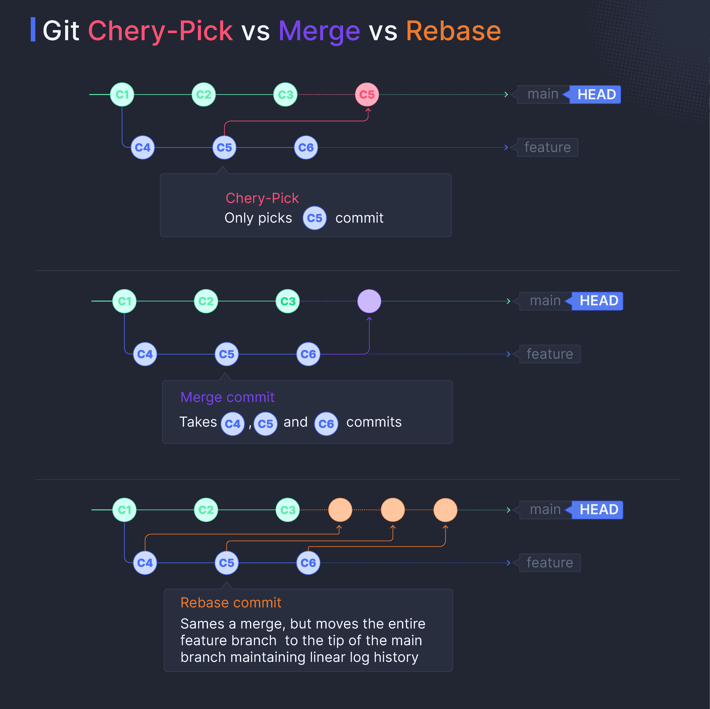

**Nota:** Este caso de estudio documenta la transición de un modelo de despliegue manual a un flujo de trabajo basado en estándares internacionales de ingeniería.

## Resumen del Proyecto

Al asumir el liderazgo del área de desarrollo, identifiqué que los despliegues a producción se realizaban de forma artesanal, utilizando *cherry-picking* manual y despliegues directos desde entornos locales. Este proceso generaba una alta probabilidad de error humano, dificultaba el seguimiento de versiones y hacía que los *rollbacks* ante incidentes fueran lentos y riesgosos.

Implementé un modelo de **GitFlow robusto** y estandaricé la legibilidad del código, transformando la manera en que el equipo entrega valor y garantizando que cada versión en producción sea estable y trazable.

## Objetivos

1. Eliminar los despliegues manuales y desordenados para reducir el *downtime* por errores de integración.
2. Establecer un entorno de **Staging** confiable que replique exactamente las condiciones de Producción.
3. Agilizar la respuesta ante incidentes mediante la capacidad de revertir versiones de forma casi instantánea.

## Desafíos y Soluciones

1. **Reestructuración del Flujo de Trabajo (GitFlow):**
- Diseñé e implementé una jerarquía de ramas clara: `feature` -> `develop` (Staging) -> `master` (Production).
- Introduje el uso de **Chore Releases** y etiquetas de versión para mantener un historial de cambios (Changelog) comprensible tanto para técnicos como para stakeholders.

2. **Cultura de Revisión y Legibilidad:**
- Fomenté la práctica de "Clean Code" y revisiones de código cruzadas. Esto no solo mejoró la calidad del software, sino que sirvió como una herramienta de aprendizaje continuo para los desarrolladores.

3. **Optimización de Despliegues y Reversiones:**
- Automatice el proceso de paso a producción mediante merges controlados. Si una funcionalidad presentaba un error crítico, el equipo ahora podía realizar un `revert` a una versión estable previa en minutos, minimizando el impacto en los usuarios finales.

4. **Mentoring y Adopción:**
- Capacité al equipo en el uso de estas nuevas herramientas y flujos, explicando los beneficios de seguridad y orden que aporta el cumplimiento de estándares profesionales de Git.

## Stack Tecnológico

- **Control de Versiones:** Git (GitHub / GitLab).
- **Flujos de Trabajo:** GitFlow, Semantic Versioning.
- **Entornos:** Staging, Production, Local Development.
- **Metodología:** Code Reviews, Clean Code.

## Resultado

La profesionalización del flujo de desarrollo tuvo un impacto inmediato: la tasa de errores en producción disminuyó drásticamente y la confianza del equipo al liberar nuevas funcionalidades aumentó. Ahora contamos con una línea de tiempo clara de la evolución del producto, permitiendo una escalabilidad ordenada y una capacidad de respuesta técnica que cumple con los estándares de las mejores empresas tecnológicas del sector.

[Diagram of a professional GitFlow showing Feature branches, Staging environment, and Production Releases]