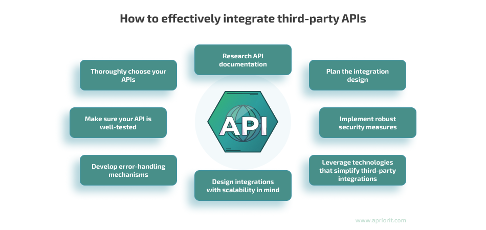

**Nota:** Este caso de estudio documenta la resolución de un requerimiento técnico urgente para la sincronización de datos biométricos entre plataformas.

## Resumen del Proyecto

La plataforma requería una integración robusta con la aplicación de control de acceso (sistema de control de asistencia) para automatizar el flujo de datos de los trabajadores de nuestros clientes. El proyecto se encontraba en un punto crítico: la implementación inicial no cubría las nuevas funcionalidades exigidas y el cliente directo necesitaba la solución de forma inmediata para la toma de decisiones operativas.

Asumí el liderazgo del proceso, realizando una ingeniería inversa de la implementación previa y un estudio profundo de la documentación técnica de la API externa para garantizar una sincronización de datos precisa y escalable.

## Objetivos

1. Re-arquitecturar la integración con la API de aplicación de control de acceso para dar soporte a nuevas funcionalidades de control de acceso.
2. Asegurar la integridad de la data sincronizada entre ambos sistemas, eliminando discrepancias en los registros biométricos.
3. Liderar la comunicación técnica entre el equipo de desarrollo y el cliente para restaurar la confianza en el producto.

## Desafíos y Soluciones

1. **Análisis y Priorización de Crisis:**
- Identifiqué que el cuello de botella residía en una mala comprensión de los endpoints de la API externa. Documenté el proceso completo y establecí una hoja de ruta de "necesidad urgente" para priorizar el desarrollo.

2. **Colaboración Técnica Efectiva:**
- Trabajé codo a codo con el desarrollador junior original y el equipo de implementación. Mi rol fue actuar como puente, facilitando la lógica de negocio y guiando la codificación para que se alineara con los requisitos del usuario final.

3. **Optimización del Consumo de API:**
- Implementé una lógica de manejo de excepciones y reintentos para asegurar que, ante fallos en el servicio externo, nuestro sistema mantuviera la consistencia de los datos.
- Mejoré el mapeo de datos entre los microservicios de nuestra plataforma de control de contratistas y el sistema externo.

4. **Gestión de Expectativas (TPM):**
- Participé en reuniones directivas para explicar el avance técnico en lenguaje de negocio, asegurando que el cliente comprendiera los plazos y la solidez de la nueva solución implementada.

## Stack Tecnológico

- **Integraciones:** REST APIs (Consumo y autenticación).
- **Backend:** Node.js / PHP.
- **Base de Datos:** PostgreSQL (Sincronización de registros).
- **Gestión:** Technical Product Management (TPM) y Metodologías Ágiles.

## Resultado

El rescate de la integración con aplicación de control de acceso fue un éxito rotundo. Logramos implementar las funcionalidades faltantes en tiempo récord, permitiendo al cliente automatizar el control de asistencia de miles de trabajadores. Esta intervención no solo salvó una cuenta clave para la empresa, sino que estableció un estándar de cómo abordar integraciones de terceros mediante una correcta comprensión de la documentación y una gestión de equipo coordinada.

[Diagram of API integration flow between the contractor control platform and third-party biometric services]