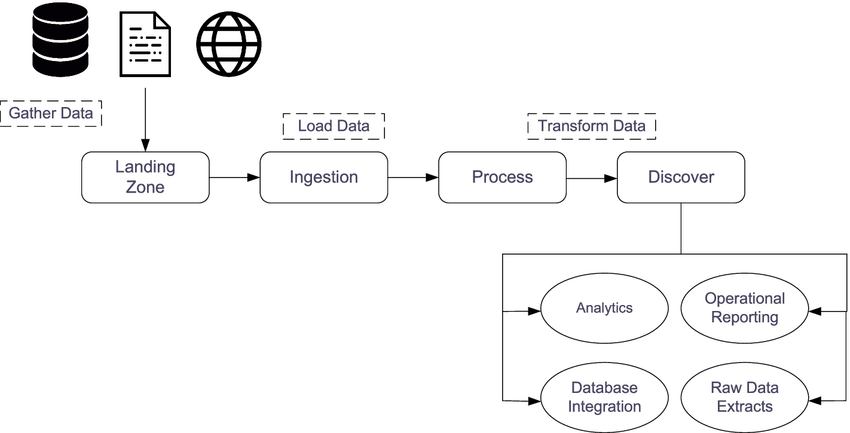

**Nota:** Este caso de estudio documenta una solución de ingeniería de sistemas diseñada para manejar volúmenes de datos a escala industrial mediante automatización de bajo nivel.

## Resumen del Proyecto

La integración de grandes clientes corporativos en la plataforma la aplicación de control de contratistas implicaba el desafío de cargar y procesar más de un millón de documentos físicos y registros lógicos de forma simultánea. Realizar este proceso a través de la interfaz web era inviable por estabilidad y tiempo, mientras que las cargas manuales en base de datos carecían de la validación necesaria de los microservicios.

Desarrollé una herramienta de orquestación personalizada en **Bash** que actúa como un motor de ingesta masiva, replicando el comportamiento de la aplicación de forma acelerada y segura directamente desde la terminal del servidor.

## Objetivos

1. Automatizar la migración de datos masivos para nuevos clientes, reduciendo el tiempo de implementación de semanas a horas.
2. Garantizar la integridad de la información mediante validaciones cruzadas entre archivos CSV, Base de Datos y APIs.
3. Crear un proceso resiliente capaz de manejar fallos de red y errores de archivos sin detener la operación global.

## Características Técnicas

1. **Orquestación de Sistemas (CLI):**
- Implementé un flujo de trabajo que integra herramientas como `psql` para consultas directas, `curl` para comunicación con APIs REST y `jq` para el procesamiento de respuestas JSON en tiempo real.

2. **Lógica de Resiliencia (Fault Tolerance):**
- El script incluye un sistema de manejo de reintentos automáticos (`max_intentos`) y validación de carga física versus carga lógica, asegurando que cada documento sea procesado correctamente antes de pasar al siguiente.

3. **Adaptación de Datos Dinámica:**
- Desarrollé funciones de extracción y transformación que normalizan la información del cliente (RUTs, IDs, fechas) para que sean compatibles con la arquitectura interna del sistema, detectando y limpiando "datos basura" en el proceso.

4. **Monitoreo y Reporte de Resultados:**
- El sistema genera logs detallados y un archivo de resultados CSV al finalizar, permitiendo una auditoría inmediata de qué registros fueron exitosos y cuáles requieren atención manual.

## Stack Tecnológico

- **Lenguaje:** Bash Scripting (GNU/Linux).
- **Procesamiento:** jq (JSON Processor), awk, sed.
- **Base de Datos:** PostgreSQL (Interacción directa mediante CLI).
- **Protocolos:** REST APIs / cURL con autenticación Bearer.

## Resultado

Este motor de automatización se convirtió en una pieza fundamental de nuestra infraestructura. Logramos procesar con éxito cargas de **1M+ de documentos**, garantizando que cada archivo estuviera correctamente validado y vinculado a su trabajador o empresa correspondiente. La solución no solo eliminó el error humano en las migraciones de datos, sino que dotó a la empresa de una capacidad técnica superior para abordar clientes de gran escala que la competencia no podía gestionar con la misma agilidad.