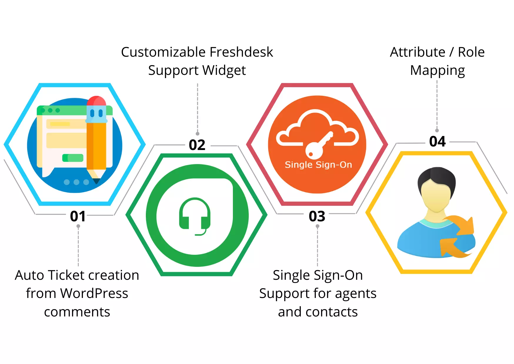

**Nota:** Este caso de estudio documenta mi transición hacia roles de gestión, donde diseñé la estrategia de atención técnica para una plataforma SaaS con miles de usuarios activos.

## Resumen del Proyecto

El crecimiento acelerado de la plataforma generó un cuello de botella en la atención al cliente. Las solicitudes llegaban de forma desordenada por múltiples canales (email, teléfono, chat), lo que dificultaba la trazabilidad y la resolución de errores técnicos complejos. El equipo de desarrollo se veía constantemente interrumpido por incidencias que no estaban filtradas.

Lideré la implementación de **Freshdesk** como centro neurálgico de operaciones, creando un flujo de **Soporte Nivel 3** que conectó directamente las necesidades del cliente con el ciclo de desarrollo del producto.

## Objetivos

1. Centralizar todas las comunicaciones de soporte en una sola plataforma profesional.
2. Establecer niveles de servicio (SLA) para garantizar respuestas rápidas y efectivas a los clientes corporativos.
3. Crear un puente eficiente entre el equipo de soporte y el equipo de ingeniería para la resolución de bugs críticos.

## Desafíos y Soluciones

1. **Implementación de Freshdesk desde Cero:**
- Participe en el diseño de la arquitectura de tickets, categorías y prioridades basada en el impacto de negocio de cada incidencia.
- Automaticé flujos de trabajo para asignar tareas a los agentes correctos según su especialización técnica.

2. **Estructura de Soporte Nivel 3:**
- Definí el proceso de escalamiento: Nivel 1 (Atención básica), Nivel 2 (Configuraciones avanzadas) y Nivel 3 (Ingeniería de software). Esto permitió que el equipo de desarrollo solo interviniera en problemas reales de código, aumentando su productividad.

3. **Análisis de Datos para Mejora del Producto:**
- Utilicé los reportes de Freshdesk para identificar las áreas de la aplicación que generaban más fricción. Estas métricas se convirtieron en la base para priorizar el **Backlog de Producto**, transformando quejas en nuevas funcionalidades.

4. **Retención de Clientes (Churn Reduction):**
- Al profesionalizar el soporte, la percepción de calidad del servicio aumentó. Los clientes sintieron que sus problemas eran escuchados y resueltos con trazabilidad, lo que redujo significativamente la tasa de cancelación del servicio.

## Stack Tecnológico

- **Gestión de Soporte:** Freshdesk (Omnichannel).
- **Product Management:** Análisis de métricas (SLA, resolución en primer contacto).
- **Comunicación:** Integración Slack-Freshdesk para alertas de alta prioridad.
- **Documentación:** Creación de base de conocimientos (Knowledge Base) para autoservicio.

## Resultado

La transformación del área de soporte cambió la dinámica de la empresa. Pasamos de una gestión reactiva y caótica a un modelo proactivo y basado en datos. Logramos una reducción del 40% en el tiempo de respuesta inicial y, lo más importante, liberamos al equipo de desarrollo de tareas repetitivas, permitiéndoles enfocarse en la innovación de la plataforma. Este proyecto consolidó mi rol como el nexo vital entre la tecnología y la satisfacción del cliente.

[Diagram of the support escalation flow from Client to Support Level 1, 2, and Engineering Level 3]