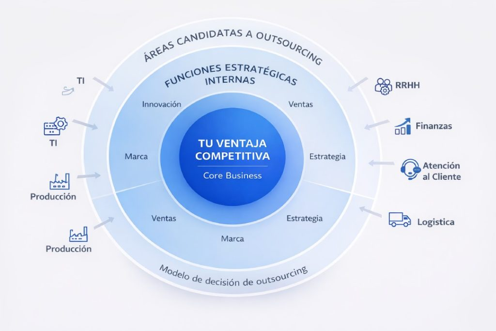

**Nota:** Este caso de estudio documenta una solución real implementada para optimizar la gestión financiera y legal en un entorno B2B SaaS.

## Resumen del Proyecto

El sistema original carecía de una forma consolidada de verificar si los subcontratistas estaban al día con sus obligaciones legales (nóminas, F30, leyes sociales) antes de autorizar pagos. La información estaba dispersa en múltiples tablas y microservicios, lo que generaba un alto riesgo legal y horas de trabajo manual.

Desarrollé un **motor de cumplimiento dinámico** que actúa como una "fuente de verdad única", permitiendo a los directores de la empresa y a los clientes finales tomar decisiones basadas en datos exactos y actualizados.

## Objetivos

1. Consolidar data dispersa de trabajadores, empresas y documentos legales en un solo reporte maestro.
2. Automatizar el cálculo de porcentajes de cumplimiento basado en reglas de negocio complejas.
3. Reducir a cero el error humano en la validación de documentación necesaria para la liberación de pagos.

## Características Principales

1. **Motor de Consultas de Alta Complejidad:**
- Uso intensivo de **Common Table Expressions (CTEs)** para segmentar la lógica de negocio (períodos, obligaciones, previsiones y liquidaciones).
- Implementación de lógica condicional avanzada para detectar discrepancias entre trabajadores activos y documentos cargados.

2. **Integración de Flujo de Datos (BI):**
- Conexión del motor SQL con **Make (Integromat)** para la exportación automatizada.
- Visualización de resultados en **Looker Studio**, permitiendo filtros dinámicos por cliente, área y gerencia.

3. **Escalabilidad y Rendimiento:**
- Optimización de la query mediante el uso de `FILTER`, `UNNEST` y `CROSS JOIN` para manejar grandes volúmenes de registros sin degradar el rendimiento del clúster.

4. **Validación Automática de Documentación:**
- El sistema detecta automáticamente si faltan archivos críticos (F30-1, Previred, Libros de Remuneraciones) según el tipo de empresa y período vigente.

## Stack Tecnológico

- **Base de Datos:** PostgreSQL (Nivel Avanzado).
- **Automatización:** Make (Integromat).
- **Visualización:** Looker Studio (Google Data Studio).
- **Infraestructura:** DigitalOcean Managed Databases.

## Resultado

La implementación de este motor transformó la operación de la empresa. Se eliminaron las revisiones manuales que tomaban días, permitiendo que el equipo de soporte y finanzas se enfoque en excepciones reales. La confianza del cliente aumentó significativamente al disponer de un tablero de control transparente que garantiza que cada pago realizado cumple con la normativa legal vigente.

---