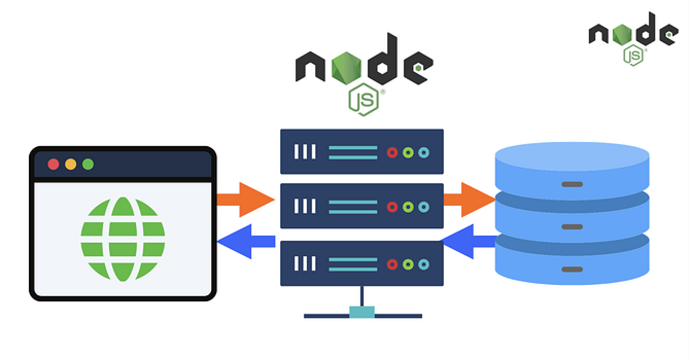

Para mí, Node.js es el motor que permite transformar reglas de negocio complejas en sistemas eficientes. Lo utilizo como pieza clave para construir soluciones B2B donde la integridad de los datos y la concurrencia son el corazón del producto.

## Soluciones técnicas con impacto

* **APIs de Alto Rendimiento:** Diseño arquitecturas robustas centradas en la seguridad (JWT) y la consistencia. Mi prioridad es que el flujo de información entre servicios sea impecable y libre de fricciones técnicas.
* **Escalabilidad modular:** En proyectos como **Zerty**, implementé microservicios especializados en procesos pesados, permitiendo que la plataforma crezca de forma orgánica sin sacrificar la estabilidad de la infraestructura principal.
* **Procesamiento Asíncrono:** Gestiono flujos de datos masivos en tiempo real, optimizando el rendimiento del sistema para garantizar el cumplimiento operativo sin generar cuellos de botella.

> "Mi enfoque no es solo escribir código limpio, sino diseñar una arquitectura técnica que soporte directamente la estrategia y el crecimiento del negocio."

## Trayectoria y Resultados

En **Escaleno**, logré automatizar integraciones críticas y flujos legales complejos que hoy permiten a grandes corporativos operar con una intervención humana mínima. Mi objetivo es siempre el mismo: convertir problemas de ingeniería difíciles en servicios escalables, testeables y rentables.