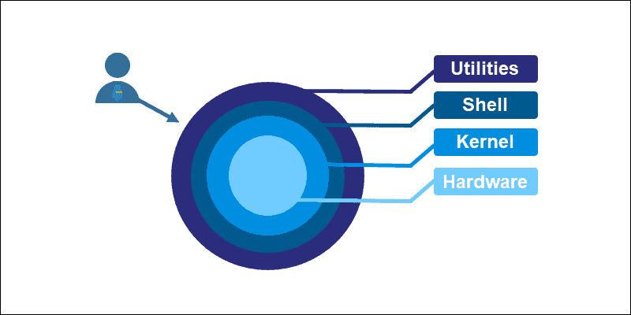

La verdadera robustez de una plataforma reside en su capacidad para autogestionarse. Más allá del código de aplicación, diseño sistemas que "se cuidan solos", delegando tareas pesadas y recurrentes a procesos de fondo que garantizan una experiencia de usuario fluida y constante.

## Pilares de la operación autónoma

* **Bash Scripting de Precisión:** Utilizo la terminal para orquestar despliegues, realizar backups automatizados y procesar archivos de sistema de forma masiva. Es mi herramienta para resolver problemas de infraestructura donde las interfaces visuales no llegan.
* **Cronjobs e Higiene del Sistema:** Implemento tareas programadas para la rotación de logs, limpieza de datos y generación nocturna de reportes legales. Aseguro que los recursos del servidor estén optimizados y los datos listos antes de que el primer usuario inicie sesión.
* **Workers y Colas de Procesamiento:** Gestiono la carga pesada (como el procesamiento masivo de documentos en la aplicación de control de contratistas) mediante workers asíncronos. Esto evita cuellos de botella en la API y garantiza que la plataforma responda con latencia mínima, incluso bajo alta demanda.

> "La automatización no es una comodidad, es una necesidad estratégica. Un sistema que requiere intervención manual para tareas repetitivas es un sistema que no puede escalar."

## Ingeniería de Extremo a Extremo

Dominar la automatización de procesos cierra mi perfil técnico. Mi visión de una plataforma es la de un organismo vivo que debe operar con eficiencia máxima; mi enfoque siempre es eliminar la fricción y reducir el error humano. Al automatizar la salud del sistema, permito que el negocio crezca de forma desatendida, transformando la tecnología en un activo de alta disponibilidad y bajo mantenimiento.