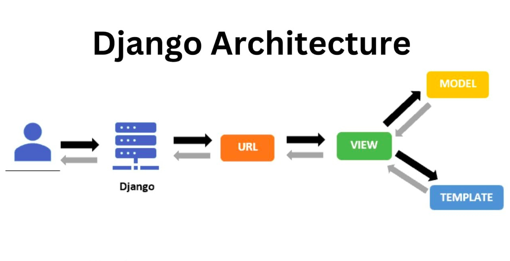

Python es mi lenguaje de elección cuando la velocidad de entrega y la versatilidad son fundamentales. Lo utilizo como una "navaja suiza" estratégica, capaz de sostener desde aplicaciones web completas hasta scripts de ingeniería que eliminan el trabajo manual.

## Ingeniería de eficiencia con Python

* **Desarrollo Rápido con Django:** Construyo plataformas robustas bajo el paradigma de "baterías incluidas". Aprovecho su ORM para manejar datos complejos y su arquitectura segura para entregar productos funcionales en tiempo récord.
* **Automatización de Procesos:** Diseño scripts inteligentes para el procesamiento masivo de archivos y la limpieza de datos. Mi objetivo es transformar tareas operativas de horas en ejecuciones de segundos, minimizando el error humano.
* **Conectividad y ETL:** Desarrollo puentes entre plataformas mediante integraciones de API, automatizando la extracción y transformación de información para alimentar sistemas de toma de decisiones (BI).

> "No veo a Python solo como un lenguaje de programación, sino como una herramienta de optimización constante para el flujo de valor de la empresa."

## Impacto en la Operación

Mi enfoque con Python es puramente pragmático: si un proceso se repite, debe ser automatizado. He implementado soluciones que actúan como el pegamento entre servicios de terceros, garantizando que los datos fluyan y que el equipo de desarrollo pueda centrarse en innovar, no en realizar tareas repetitivas.