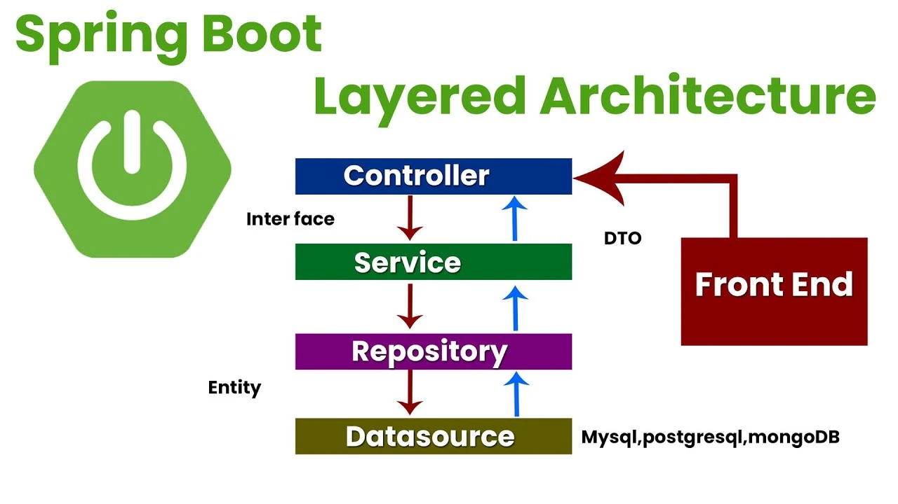

Java es mi estándar para proyectos que exigen fiabilidad absoluta. Utilizo el ecosistema de Spring Boot no solo para escribir código, sino para diseñar arquitecturas de microservicios que sean resistentes, fáciles de testear y listas para escalar.

## Ingeniería empresarial con Spring

* **Microservicios y Seguridad:** Implemento servicios autocontenidos utilizando Spring Cloud y Spring Security. Diseño ecosistemas que gestionan la autenticación y la configuración centralizada de forma profesional y segura.
* **Arquitectura Limpia:** Aprovecho el tipado fuerte de Java y patrones como Inyección de Dependencias (DI) para mantener un código desacoplado. Mi objetivo es que la lógica de negocio sea modular y fácil de evolucionar.
* **Persistencia e Integridad:** Gestiono datos críticos mediante Spring Data JPA y Hibernate, asegurando transacciones atómicas y optimizando el rendimiento de las consultas en bases de datos relacionales de alta carga.

> "La robustez de Java me permite construir el cimiento sólido que cualquier plataforma SaaS necesita para soportar un crecimiento masivo sin comprometer la estabilidad."

## Visión a largo plazo

Mi enfoque con Java es puramente sistémico. En entornos donde los requisitos cambian, utilizo la modularidad de Spring Boot para adaptar la lógica de negocio rápidamente. Esto me permite asegurar que el backend no sea solo funcional hoy, sino mantenible y rentable durante todo su ciclo de vida.