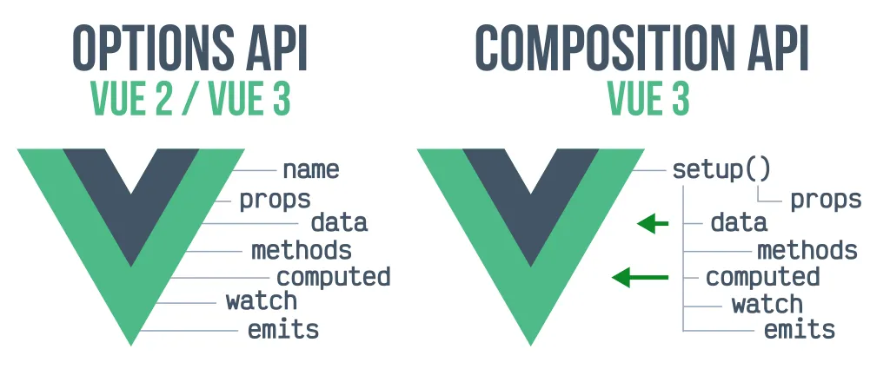

Vue.js es mi estándar para transformar datos complejos en experiencias de usuario fluidas. Mi enfoque actual se centra en exprimir la potencia de Vue 3 para construir interfaces que no solo sean visualmente atractivas, sino técnicamente sostenibles a largo plazo.

## Evolución y rendimiento frontend

* **Composition API y Modularidad:** Estructuro la lógica de negocio mediante *Composables*, permitiendo una reutilización de código superior y facilitando el testing. He dejado atrás las arquitecturas monolíticas para adoptar un flujo de trabajo modular y escalable.
* **Migración Estratégica:** Cuento con experiencia liderando el salto de Vue 2 a Vue 3 en plataformas de producción. Mi prioridad es la migración incremental: evolucionar la tecnología sin detener la entrega de valor al negocio.
* **Estado y Reactividad Proactiva:** Utilizo Pinia para gestionar estados complejos de manera predecible. Esto es crítico en entornos SaaS donde la información debe sincronizarse en tiempo real a través de múltiples vistas sin penalizar el rendimiento.

> "Mi objetivo con Vue es construir una base de código que crezca con la empresa, eliminando la deuda técnica y permitiendo que la innovación sea constante y fluida."

## Enfoque en el Producto

Como Product Engineer, utilizo herramientas como Vite para acelerar el ciclo de desarrollo y la respuesta del usuario final. No me limito a "maquetar"; diseño la capa de presentación como una extensión eficiente de la lógica de negocio, garantizando que cada interacción sea instantánea y cada componente sea una pieza de ingeniería reutilizable.