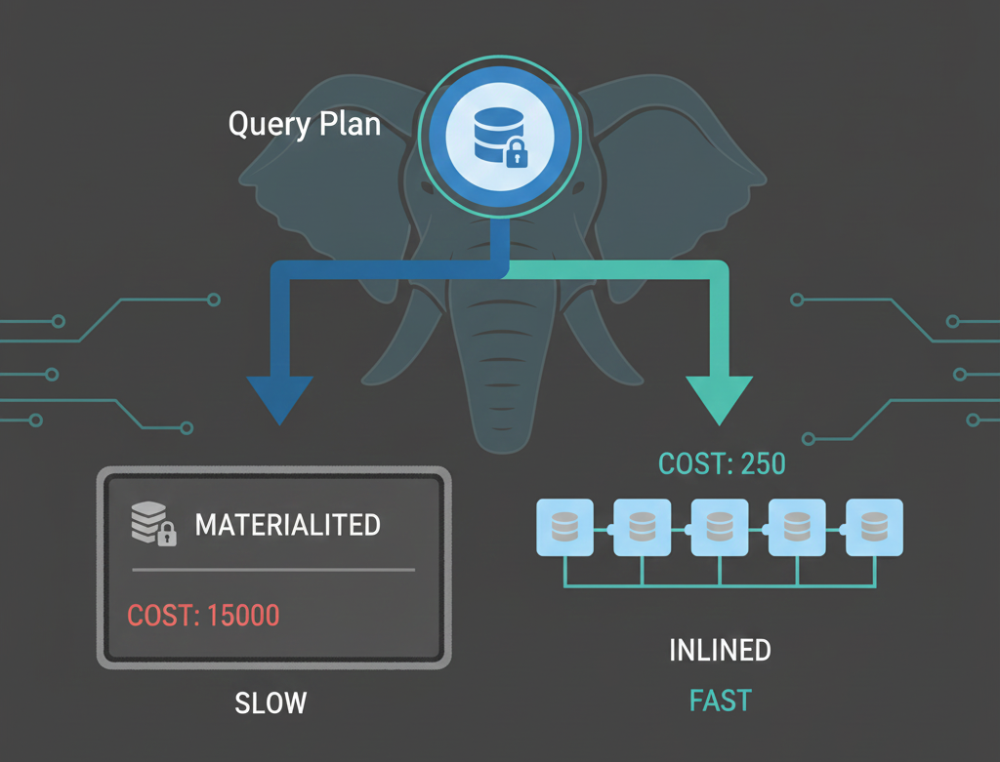

Una aplicación es tan rápida como su consulta más lenta. Utilizo PostgreSQL no solo para almacenar información, sino como un motor de lógica avanzada capaz de transformar millones de registros en decisiones de negocio en tiempo real.

## Ingeniería de datos de alto nivel

* **Optimización y Query Tuning:** Analizo cada ejecución mediante `EXPLAIN ANALYZE`. Mi enfoque es eliminar cuellos de botella mediante el uso estratégico de índices (B-Tree, GIN, Parciales), reduciendo tiempos de respuesta de segundos a milisegundos.
* **Lógica Compleja con CTEs:** Utilizo Common Table Expressions para desglosar reglas de negocio legales e intrincadas en procesos legibles y eficientes, garantizando que los reportes de cumplimiento sean precisos y mantenibles.
* **Escalabilidad y Modelado:** Diseño esquemas que garantizan la integridad referencial y la escalabilidad. Implemento estrategias de particionamiento y limpieza de datos para asegurar que el sistema mantenga su agilidad ante crecimientos masivos de información.

> "El SQL es una herramienta de programación lógica. Dominar PostgreSQL a nivel profundo es lo que permite que un backend escale de forma profesional bajo cargas extremas."

## Impacto en el Producto

En proyectos como la aplicación de control de contratistas, mi capacidad para realizar consultas complejas sobre cumplimiento legal permitió automatizar procesos que antes tomaban días. Al transformar la base de datos en una ventaja competitiva, facilito que el negocio entregue tableros de control exactos y en tiempo real, fundamentales para la confianza de los grandes clientes corporativos.